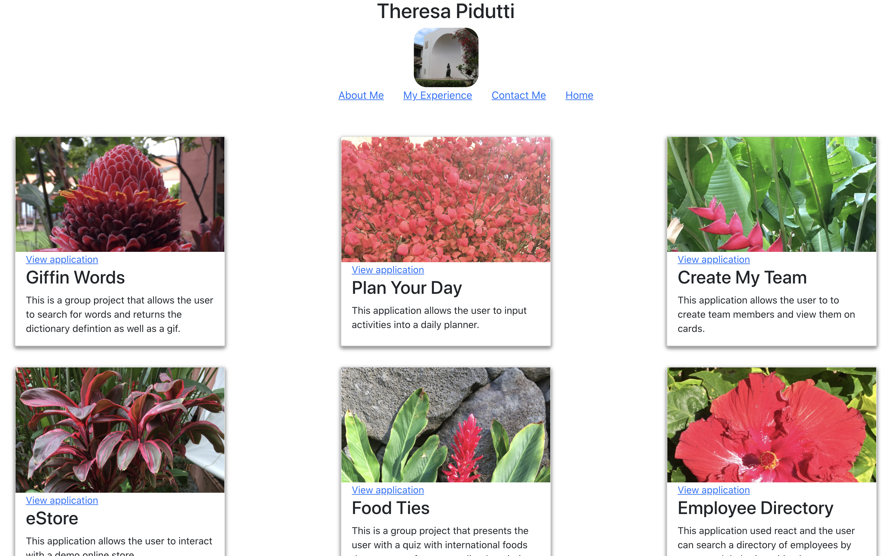

# reactPortfolioTheresaPidutti

## Description

This application is a portfolio of my classwork.



## Table of Contents

\*[Installation](#installation)

\*[Usage](#usage)

\*[License](#license)

\*[Contribution](#contribution)

\*[Tests](#tests)

\*[Questions](#questions)

### Installation

This application was create with React.

### Usage

This application is to display some of the homework assignements and class projects that I completed or participated in over the three month bootcamp course.

### License

This project is licensed under MIT.

### Contribution

This application will be updated as improvements are made to projects.

### Tests

None at this time.

## Questions

```
Please contact me, Theresa, with any questions you might have about this project.  You can reach me at bountravel@hotmail.com or view more of my work at GitHub, [tpidutti](https://github.com/tpidutti).
```
